# 🔬 Thermal Monitoring and Predictive Modelling for Additive Manufacturing

> **University Project — Lab Data Science for Industrial Engineering**  
> Politecnico di Milano · A.Y. 2025/2026

[](https://www.python.org/)
[](https://opencv.org/)
[](https://scikit-learn.org/)
[](LICENSE)

---

## 🎬 Live Demos — Computer Vision and Thermal Analysis Pipelines

### 1. In Situ Thermal Video ROI Extraction During 3D Printing

<p align="center">
  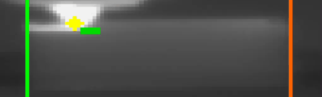
</p>

> Real time infrared thermal field extraction during Fused Filament Fabrication (FFF) of ABS specimens. The vision algorithm tracks the heated nozzle via Normalized Cross Correlation (NCC), extracts a local Region of Interest (ROI) around the active melt pool, and samples the spatial temperature distribution frame by frame.

---

### 2. Computer Vision Deflection Tracking During Mechanical Bending Tests

<p align="center">
  
</p>

> Real time computer vision tracking of specimen deflection during quasi static cantilever bending tests. A dual template matching tracker follows the physical marker along the vertical axis, synchronizing displacement measurements with discrete loading steps to automatically extract structural compliance, elastic modulus, and failure load without physical contact sensors.

---

## 🎯 Project Overview

This project investigates whether **in situ thermal infrared video monitoring** during Fused Filament Fabrication (FFF) can predict the **mechanical failure load** of additively manufactured components.

In remote manufacturing, space applications, and autonomous fabrication facilities, trial and error production is unsustainable: **first time right manufacturing** is mandatory. By monitoring the thermal history of each layer in real time, early defects and poor interlayer bonding can be identified before destructive mechanical testing.

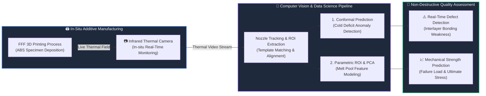

The project develops and validates **three complementary engineering pipelines**:

1. **Conformal Prediction Pipeline**: A distribution free statistical framework to detect anomalous cooling caused by controlled printing pauses and correlate thermal deficit with failure load.
2. **Parametric ROI Thermal Analysis and PCA**: Local thermal feature extraction adjacent to the nozzle, systematic grid search optimization over ROI geometry, and quadratic regression on principal components (`R² = 0.78`).
3. **Mechanical Video Processing**: Non contact optical deflection measurement during quasi static bending tests, extracting structural compliance, elastic modulus, and ultimate breaking load directly from video recordings.

---

## ⚗️ Experimental Design (DoE)

### Controlled Printing Interruptions

ABS specimens were manufactured via FFF under identical printing parameters. At a designated layer during deposition, **programmed pauses** of varying durations were injected to induce controlled, reproducible thermal discontinuities at the interlayer boundary:

| Condition | Specimens | Interruption Duration | Thermal Effect at Restart |
|---|---|---|---|
| Standard | Std 1, Std 2 | 0 s | Continuous nominal baseline |
| 10 s pause | 10s 1, 10s 2 | 10 s | Mild substrate cooling |
| 30 s pause | 30s 1 to 30s 4 | 30 s | Moderate temperature drop |
| 60 s pause | 60s 1, 60s 2 | 60 s | Severe thermal discontinuity |
| 90 s pause | 90s 1, 90s 2 | 90 s | Complete substrate cooling |

---

## 📁 Repository Structure

```
thermal-monitoring-and-predictive-modelling-additive-manufacturing/
│
├── conformal_prediction/          # Pipeline 1: Conformal anomaly detection
│   └── finale/
│       ├── 1_aestrazione_frame.ipynb       # Thermal video frame extraction
│       ├── 1b_estrazione_frame_601.ipynb    # Frame extraction (specimen 601)
│       ├── 2_tracking_allungamento.ipynb    # Nozzle tracking and stroke alignment
│       ├── 3_conformal.ipynb               # Distribution free conformal anomaly detection
│       ├── 4_the_end.ipynb                 # Regression: thermal deficit vs failure load
│       └── dati/                           # Tracking sequences, kernels, and metadata
│
├── roi_analysis/                  # Pipeline 2: ROI thermal feature extraction & PCA
│   ├── thermal_viewer.ipynb       # Interactive thermal dataset explorer
│   ├── config.py                  # Geometric configuration and ROI parameters
│   ├── Dataset_giusti/            # Processed feature tables and PCA models
│   └── data/                      # Raw thermal feature matrices
│
├── mechanical_video_processing/   # Pipeline 3: Computer vision bending analysis
│   ├── tracking_allungamento-1.ipynb   # Marker tracking, baseline subtraction & compliance fit
│   └── dati/                      # Tracking displacement series and template kernels
│
├── media/                         # Visual assets, charts, and demo animations
│   ├── thermal_heatmap_demo.gif
│   ├── mechanical_deflection_tracking_demo.gif
│   ├── nozzle_tracking.png
│   ├── conformal_anomaly_heatmap.png
│   ├── conformal_anomaly_cold_deficit.png
│   ├── conformal_regression_model.png
│   ├── roi_valid_frames.png
│   ├── roi_thermal_curves.png
│   ├── roi_predictive_model.png
│   ├── roi_grid_search.png
│   ├── mech_video_setup.png
│   ├── mech_tracking_stages.png
│   ├── mech_dual_template.png
│   ├── mech_load_deflection.png
│   ├── mech_properties.png
│   └── mech_toughness_results.png
│
├── LICENSE
└── README.md
```

---

## 🔬 Pipeline 1: Conformal Prediction for Thermal Anomaly Detection

### Nozzle Tracking and Stroke Normalization

The thermal video frames are processed using **Normalized Cross Correlation (NCC)** template matching via OpenCV. A 75×65 pixel reference kernel of the heated nozzle tracks the toolhead path across all frames.

<p align="center">
  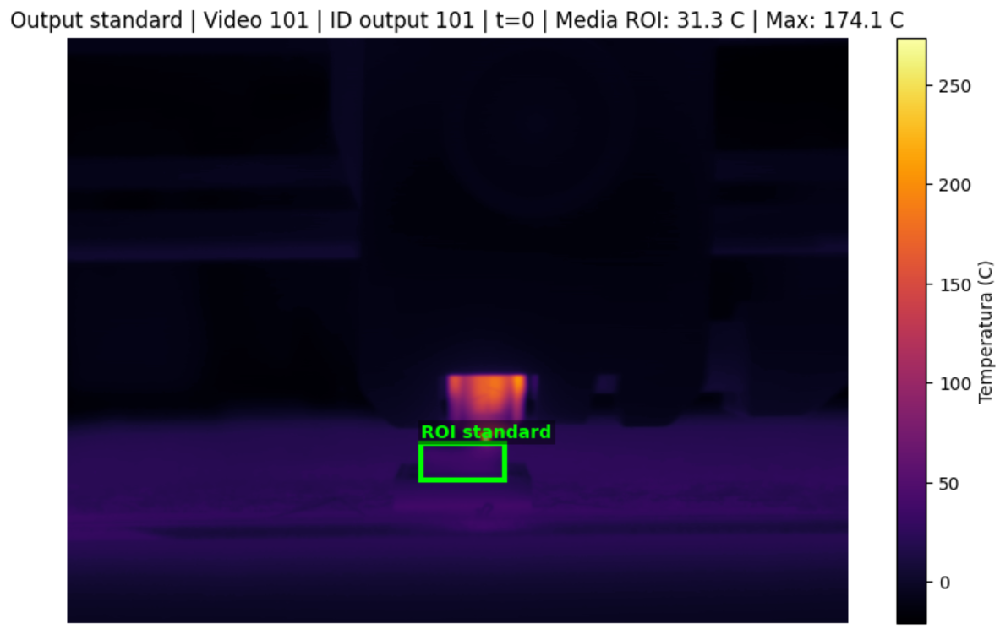
</p>

Each deposition stroke is segmented and resampled via linear interpolation to a normalized grid of **`K = 16` phase samples** (the empirical median stroke duration). This maps all deposition passes to a common spatio-temporal coordinate system, enabling exact pixel by pixel comparison.

### Conformal Prediction Framework

Traditional static temperature thresholds fail due to natural process variability. The pipeline implements **Conformal Prediction**, a distribution free uncertainty quantification method:

1. **Training Phase**: Estimates the nominal temperature profile from standard uninterrupted prints.
2. **Calibration Phase**: Evaluates non conformity scores (absolute residuals) on calibration specimens to establish dynamic tolerance bands at a user selected confidence level `1 - α`.
3. **Anomaly Detection**: Flags any pixel and phase where the observed temperature falls outside the empirical conformal interval.

<p align="center">
  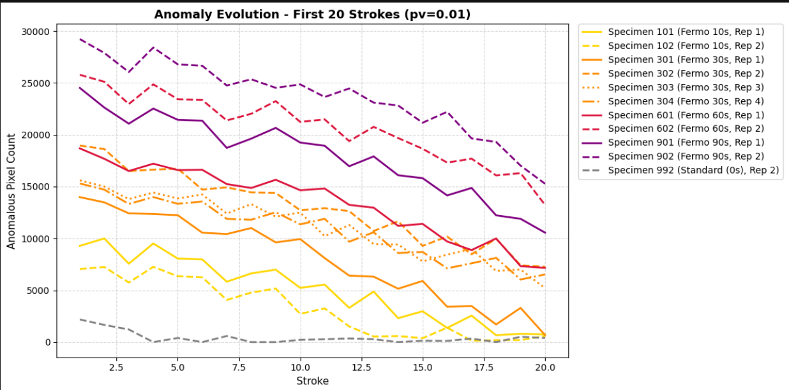
  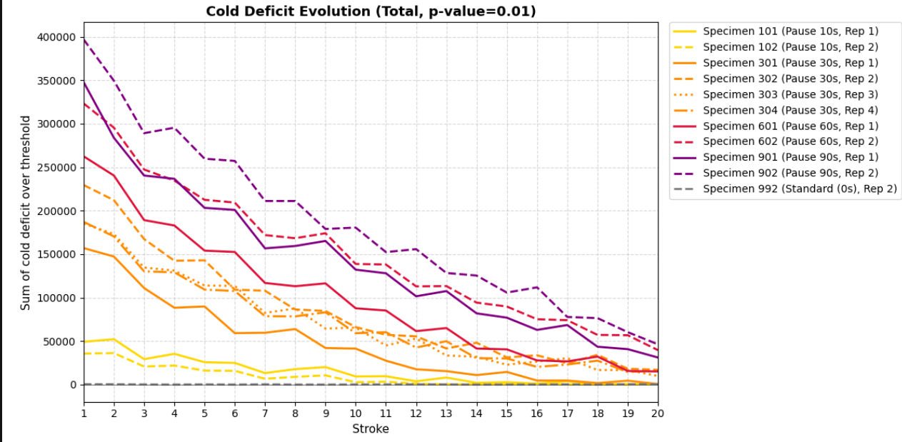
</p>

### Cold Deficit Feature & Failure Load Prediction

To quantify the intensity of abnormal substrate cooling, the **Thermal Cold Deficit** metric is computed using a strict statistical threshold (`p = 0.01`).

A **second degree polynomial regression** between the cold deficit metric and the experimental breaking load yields a robust predictive model, proving that post restart thermal signatures directly correlate with interlayer mechanical strength:

<p align="center">
  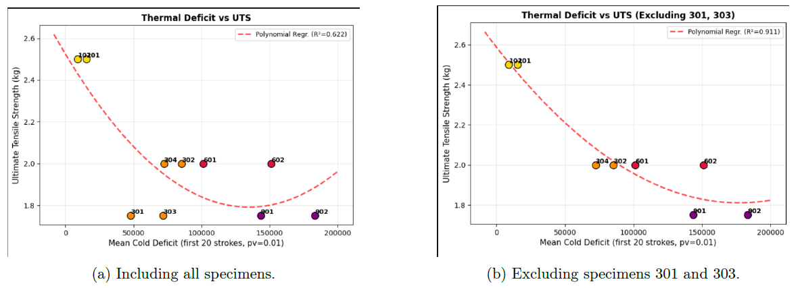
</p>

---

## 📊 Pipeline 2: Parametric ROI Thermal Analysis and PCA

### Localized Thermal Descriptors

Rather than inspecting the full scene, this pipeline defines a parametric **Region of Interest (ROI)** immediately trailing the extrusion nozzle.

<p align="center">
  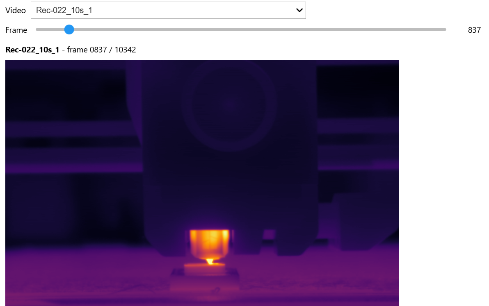
</p>

Statistical features (mean, maximum, minimum, standard deviation) and complete spatial temperature distributions are extracted for every valid deposition frame:

<p align="center">
  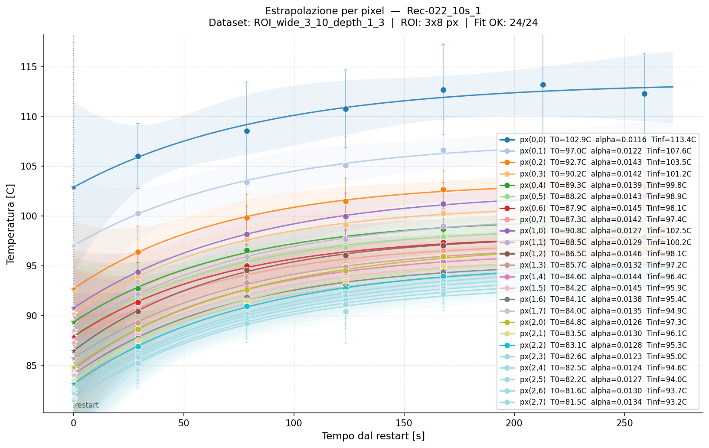
</p>

### Dimensionality Reduction via PCA and Quadratic Regression

The high dimensional thermal feature space is condensed using **Principal Component Analysis (PCA)**. The first principal component (`PC1`) captures the dominant cooling gradient across pause groups.

A quadratic regression on `PC1` provides an accurate prediction of mechanical breaking load:

<p align="center">
  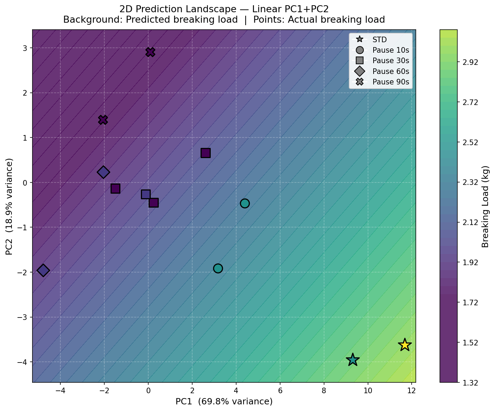
</p>

### Systematic ROI Grid Search Optimization

A comprehensive grid search over ROI horizontal span, vertical span, and toolhead offset was conducted across all specimens. The optimal configuration (`ROI 2_12_2_5`) achieved **`R² = 0.7813`**, confirming that localized melt pool thermal signatures contain strong predictive signals for part strength.

<p align="center">
  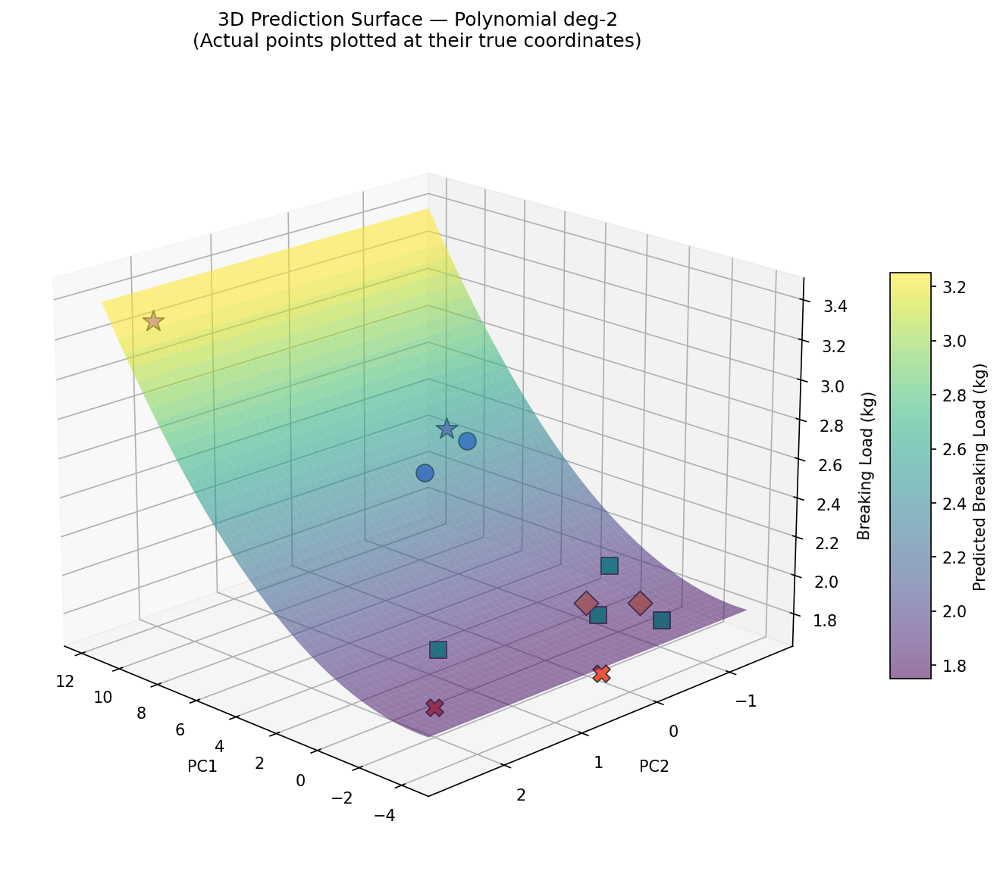
</p>

---

## 🔧 Pipeline 3: Computer Vision Mechanical Video Processing

### Optical Deflection Measurement

Cantilever bending tests were recorded on video. A computer vision tracking pipeline follows a high contrast physical marker on the specimen under progressive loading steps:

<p align="center">
  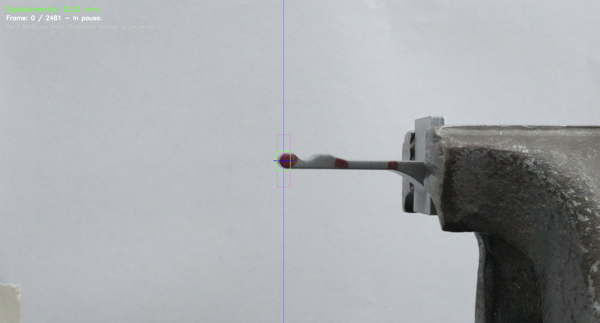
</p>

### Dual Template Tracking Architecture

To guarantee robustness against ambient lighting shifts and out of plane specimen rotation, the algorithm simultaneously tracks **two complementary templates**:
- **Dynamic Template**: Updated at every valid frame to accommodate gradual visual transformations.
- **Static Anchor Template**: Prevents drift and maintains absolute reference throughout large deflections.

<p align="center">
  
</p>

### Mechanical Property Extraction

The tracked displacement signals undergo automated plateau identification and baseline drift subtraction. The net deflection is fitted to a **weighted, origin constrained linear beam model**:

$$\delta_{\text{net}} = C \cdot F$$

From the structural compliance `C`, the pipeline automatically calculates:
- **Bending Stiffness**: `k = 1 / C`
- **Elastic Modulus**: `E = (k · L³) / (3 · I)`
- **Ultimate Bending Strength**: `σ_max = (F_break · L · y) / I`

<p align="center">
  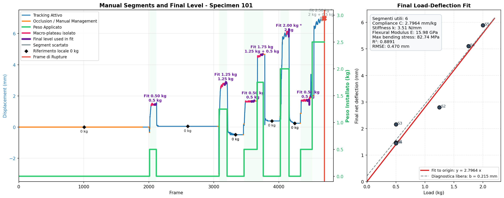
  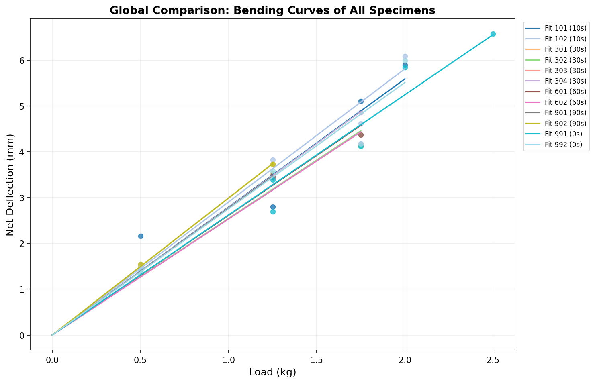
</p>

### Key Mechanical Finding: Interruption Weakens Interlayer Adhesion

- **Ultimate Strength Reduction**: The failure load systematically drops from **`3.25 kg`** (standard uninterrupted) down to **`1.75 kg`** (90s pause), representing a **`46% loss in load bearing capacity`** due to localized interlayer delamination.

<p align="center">
  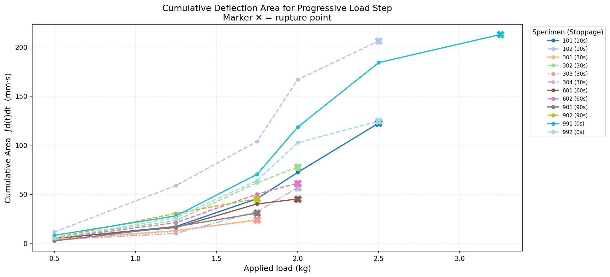
</p>

---

## 🧪 Summary of Results

| Analysis Pipeline | Target Metric | Key Outcome |
|---|---|---|
| **Conformal Prediction** | Thermal Cold Deficit | Strong polynomial correlation with fracture load at `p = 0.01` |
| **ROI Analysis + PCA** | Failure Load Prediction | `R² = 0.7813` achieved on optimal local ROI (`2_12_2_5`) |
| **Mechanical Vision** | Failure Strength (`σ_max`) | Up to `46% drop` in breaking resistance for long interruptions |

---

## ⚙️ Requirements

```
numpy
scipy
matplotlib
pandas
scikit-learn
opencv-python
Pillow
jupyter
```

### Installation

```bash
git clone https://github.com/Topfrank22/thermal-monitoring-and-predictive-modelling-additive-manufacturing.git
cd thermal-monitoring-and-predictive-modelling-additive-manufacturing
pip install numpy scipy matplotlib pandas scikit-learn opencv-python Pillow jupyter
```

### Run the Notebooks

```bash
# Pipeline 1: Conformal Prediction Anomaly Detection
jupyter notebook conformal_prediction/finale/3_conformal.ipynb

# Pipeline 2: Interactive Thermal Viewer and ROI Analysis
jupyter notebook roi_analysis/thermal_viewer.ipynb

# Pipeline 3: Mechanical Video Tracking and Property Extraction
jupyter notebook mechanical_video_processing/tracking_allungamento-1.ipynb
```

---

## 👥 Authors

- **Francesco Cardone**
- **Leonardo Fabbrini**
- **Tommaso Garavelli**
- **Simone Pasini**

*University project — Lab Data Science for Industrial Engineering, Politecnico di Milano, A.Y. 2025/2026*

---

## 📄 License

This project is released under the [MIT License](LICENSE).
